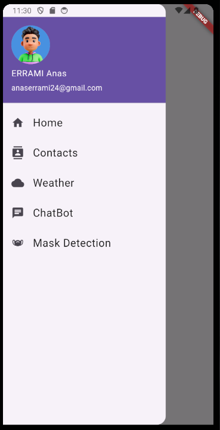
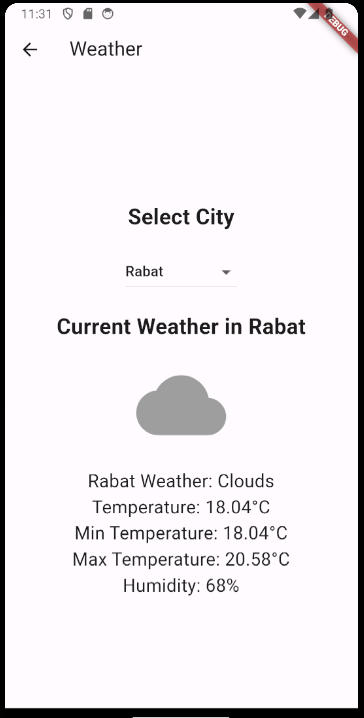
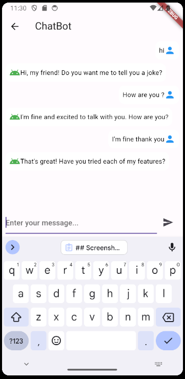
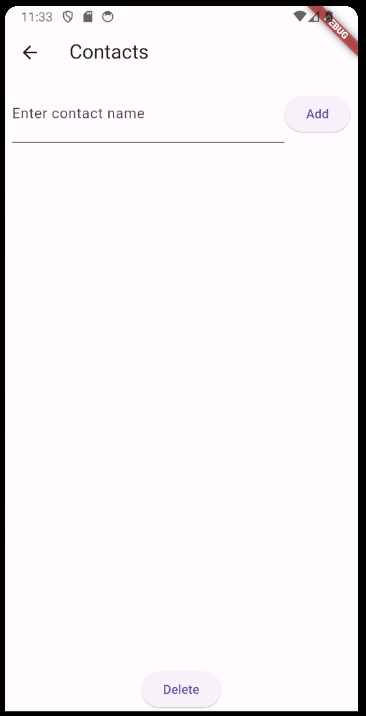
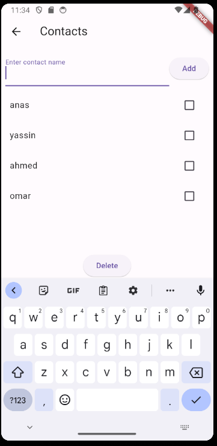
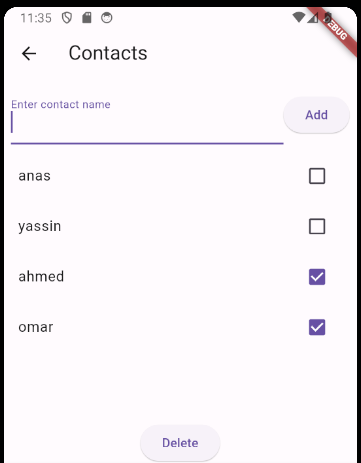
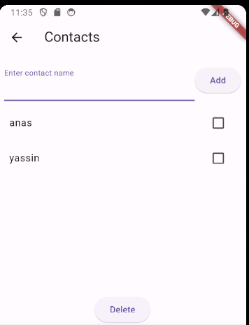

# My Flutter Synthesis App

This Flutter application combines multiple features into one, including a weather page, a ChatBot, and a contacts page. It allows users to interact with different functionalities seamlessly.

## Features

- **Home Page**: Navigate between different features using side bar.
- **Contacts Page**: Add and manage contacts with ease.
- **Weather Page**: Provides real-time weather information for selected cities in Morocco.
- **ChatBot**: Engage in conversation with an AI-powered ChatBot using the BrainShop API.

## Technologies Used

- **Dart**: Programming language used to develop the app.
- **Flutter**: UI toolkit used to build the app.
- **BrainShop API**: Used to power the ChatBot feature.
- **OpenWeatherMap API**: Used to fetch weather data for the Weather page.

## Installation

1. Clone the repository:

   ```bash
   git clone https://github.com/anaserrami/Synthesis_Alutter_App.git
   ```
   
2. Open the project in Visual Studio Code or Android Studio.
3. Install dependencies:
   
   ```bash
   flutter pub get
   ```
   
4. Build and run the project on an Android emulator or device.

   ```bash
    flutter run
    ```
   
## Usage

1. Launch the app on your device or emulator.
2. Navigate through the different pages using the drawer menu.
3. Use the weather page to check the weather for various cities.
4. Interact with the ChatBot on the ChatBot page.
5. Manage your contacts on the contacts page.

## Screenshots

**- Home Page :**



**- Weather Page :**



**- ChatBot Page :**



**- Contacts Page :**



- adding contacts :
- 


- deleting contacts :
- 
      